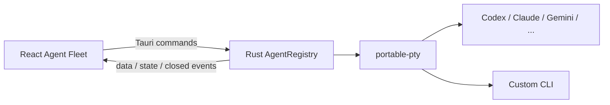

# AI Agent Fleet 架構與整合藍圖

## 目標

Agent Fleet 讓 LatticeTerm 成為多個大型語言模型 CLI 的本機工作中樞：每個 CLI 都有真正的互動式終端機，可並行執行、切換、監看與停止，同時沿用各工具原本的登入方式、設定與權限。

設計概念參考 [Herdr](https://github.com/motionharvest/herdr) 公開呈現的背景終端機、Agent 狀態與遠端 attach 模型，但本專案沒有複製或嵌入 Herdr 程式碼。第一階段先建立可驗證的桌面內 MVP，再逐步加入 daemon 與語意整合。

## 現行架構

- Rust 核心使用 [portable-pty](https://docs.rs/portable-pty/latest/portable_pty/) 建立原生 PTY，不用一般 pipe 假裝終端機。
- 內建 Codex、Claude Code、Gemini CLI、OpenCode、Copilot CLI、Hermes、Cursor Agent、Aider、Qwen Code、Kimi、Droid 與 Grok 目錄，也可輸入自訂可執行檔。
- 每個工作階段都有獨立程序、PTY、尺寸、輸入、輸出與停止控制，並與 SSH、SFTP、Lattice Remote、Web RDP 共用工作階段分頁。
- 啟動時指定經過驗證的工作目錄；CLI 可依目前作業系統使用者權限操作該目錄。
- PTY 位元組以 Base64 跨越 IPC，前端在終端機掛載前最多暫存 256 KiB，之後直接交給 xterm。
- 使用少量明確提示詞將狀態標成「可能等待輸入」；這只是提醒，不宣稱已理解每個 CLI 的完整語意。

## 安全與生命週期

- 可執行檔與參數以分離的 argument vector 交給程序，不把使用者內容串成 shell 指令。
- 自訂名稱、路徑、參數數量、單一參數大小、終端尺寸與輸入事件大小都有上限與控制字元驗證。
- LatticeTerm 不讀取、不複製也不保存模型 API 金鑰；登入仍由各 CLI 自行處理。
- CLI 以啟動 LatticeTerm 的使用者權限執行，不是沙箱。使用者只能加入自己信任的程式。
- 工作階段只存在記憶體；使用者停止或應用程式結束／重啟時會終止已登記的 CLI。
- 不保存終端輸出、提示內容或輸入歷史。
- Windows 目前只直接啟動 `.exe`／`.com`。需要 `.cmd`／`.bat` 的 npm shim 尚未經過 shell adapter 安全設計，因此不會被誤標為可用。

## 完成度矩陣

| 能力 | 現況 | 說明 |
| --- | --- | --- |
| 多 CLI 原生 PTY | 已完成 | 可同時啟動多個獨立工作階段 |
| 內建目錄與 PATH 偵測 | 已完成 | 12 種常見 CLI，可手動重新偵測 |
| 自訂 CLI adapter | 已完成 | 明確 executable 與每行一個 argument |
| 統一終端分頁 | 已完成 | 與其他 LatticeTerm 連線工具共用工作區 |
| 主動停止與退出清理 | 已完成 | 停止按鈕有確認，應用程式退出會清理 |
| 待輸入提醒 | 基礎版 | 目前為保守的終端輸出提示詞判斷 |
| CLI 語意 adapter | 未完成 | 尚無各工具 hook、session ID、token／cost 與完成狀態 |
| 背景 daemon 與重新 attach | 未完成 | 關閉 LatticeTerm 後不保留工作階段 |
| 跨重啟還原 | 未完成 | 尚未保存 workspace、pane 與 CLI restore ID |
| 遠端 Agent Fleet | 未完成 | 尚未透過 SSH 或 Lattice Remote 控制遠端 PTY |
| 任務編排 | 未完成 | 尚無 broadcast prompt、依賴圖、佇列與排程 |
| 權限隔離 | 未完成 | 尚無每 Agent 容器、沙箱或檔案範圍策略 |

## 下一階段設計

### 1. 語意 adapter

定義版本化 adapter manifest，至少包含 executable、參數模板、狀態 reporter、CLI session ID 擷取與 restore 命令。優先替 Codex、Claude Code、Gemini CLI、OpenCode 與 Hermes 實作，讓「工作中／等待輸入／完成」改由工具 hook 或本機 socket 回報；沒有 adapter 的 CLI 繼續使用保守 heuristic。

### 2. Lattice Agent daemon

將 PTY owner 從 Tauri 程序抽成使用者自行啟動的本機背景服務。桌面 UI 透過使用者專屬的 local socket attach，daemon 保存 workspace／tab／pane metadata，並使用 CLI 原生 session ID 還原。只有使用者明確選擇「留在背景」的工作階段才可脫離 UI。

### 3. 自建遠端 Fleet

遠端操作不直接混進螢幕分享資料流。重用 Lattice Remote 的一次性配對、Noise 加密與未來 Relay/NAT traversal 基礎，但建立獨立的 `terminal-control` capability、金鑰與授權畫面：

1. 被控端 Lattice Agent 預設只監聽 loopback。
2. 使用者明確啟用遠端 Agent Fleet，選擇可存取的工作目錄與操作範圍。
3. 控制端以一次性配對或已釘選裝置金鑰建立端對端加密控制通道。
4. 每個 PTY 使用獨立 multiplexed stream，控制訊息與終端資料有版本及大小上限。
5. Relay 只轉送密文；無人值守、檔案寫入與高風險指令要分開授權。

第一個遠端版本宜先支援 SSH transport，因為主機信任、認證與 Tunnel 架構較成熟；Lattice Remote transport 則作為自建 Relay 與 NAT 環境的第二條路。

### 4. 編排與可觀測性

在語意狀態可靠之後再加入工作區群組、批次啟動、broadcast prompt、任務依賴與資源限制。預設只保存狀態 metadata，不保存提示或終端逐字稿；任何錄製都必須由使用者明確開啟並設定保存位置。

## 驗收原則

- UI 顯示「可用」的能力必須有真實後端與測試。
- 各平台必須通過原生 PTY 啟動、輸入輸出、resize、停止與應用程式退出清理。
- 未安裝、立即退出、無權限、錯誤工作目錄與異常大量輸入都要回傳明確錯誤。
- 遠端版本在加入無人值守前，必須先完成裝置身分、能力授權、重放防護與 Relay 威脅模型。
