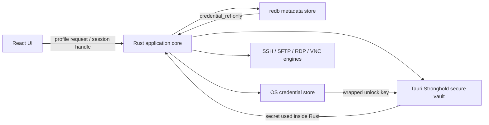

# LatticeTerm 本機儲存與安全架構決策

文件版本：0.1
更新日期：2026-08-20
狀態：Proposed

## 結論

SQLite 並不弱。它是成熟、支援交易且非常適合桌面程式的嵌入式資料庫；真正需要處理的是「原生 SQLite 檔案預設不加密」，以及認證資料不該和一般設定混在一起。

LatticeTerm 建議採分層儲存：

- **非 SQLite 首選：redb** 儲存非機密的連線索引、群組、標籤、UI 設定與資料版本。
- **Tauri Stronghold** 儲存密碼、Passphrase、匯入的私鑰、RDP 認證、Vault key 與主機信任紀錄。
- **作業系統憑證儲存區** 儲存用來解鎖／包裝 Vault 的小型金鑰，支援 Windows Credential Manager、macOS Keychain 與 Linux Secret Service 等平台機制。
- 若「主機名稱、IP、使用紀錄」本身也必須整庫加密，優先改採 **SQLCipher + Stronghold／系統憑證儲存區**，比自行設計大量欄位加密更保守。

因此推薦順序是：

1. **redb + Stronghold + OS credential store**：符合非 SQLite、純 Rust、輕量與安全分層的方向。
2. **SQLCipher + OS credential store**：當完整資料庫加密、查詢能力與成熟度比「不用 SQLite」更重要時採用。

## 為什麼不能只選一個資料庫

遠端連線工具同時包含三種不同風險的資料：

| 等級 | 範例 | 儲存要求 |
| --- | --- | --- |
| 一般中繼資料 | 顯示名稱、Protocol、Group、Tag、視窗偏好 | 需要交易、版本與崩潰復原 |
| 敏感資產資訊 | Hostname／IP、使用者名稱、連線歷史 | 視威脅模型決定是否整庫加密；不可進入診斷日誌 |
| 秘密與信任根 | 密碼、Token、私鑰、Passphrase、Host fingerprint trust | 必須加密、完整性保護、可鎖定，不能放前端持久化空間 |

資料庫適合搜尋與關聯；Vault 適合保護秘密。把所有資料都塞進同一個未加密檔案，或把 Vault 當成可查詢資料庫，都會讓架構變差。

## 建議架構

核心規則：React 前端只拿到 `credential_ref` 或短期工作階段 Handle，不拿到可長期保存的明文密碼或私鑰。

## 選項比較

| 選項 | 體積／部署 | 交易與復原 | 內建靜態加密 | Rust／Tauri 適配 | 建議 |
| --- | --- | --- | --- | --- | --- |
| redb | 輕量、嵌入式、純 Rust | ACID、MVCC、Crash-safe | 無 | 很好 | 非機密中繼資料首選 |
| SQLCipher | 輕量但含原生加密函式庫 | 延續 SQLite 的成熟交易 | AES-256 整庫加密 | 良好，需處理 native build | 整庫加密首選 |
| 原生 SQLite | 很輕、成熟 | 很好 | 無 | 很好 | 可用，但不能直接放秘密 |
| RocksDB | 較重、原生依賴多 | 強 | 無 | 可用 | 對目前規模過度設計 |
| JSON／TOML | 最簡單 | 缺少完整交易與併發控制 | 無 | 容易 | 只適合非敏感匯入／匯出格式 |
| localStorage／IndexedDB | 前端方便 | 受 WebView 邊界限制 | 無可靠 Vault 保護 | 不適合作為安全核心 | 不存連線秘密 |

redb 自己不提供透明的檔案加密，因此「redb 很安全」只能指交易完整性與崩潰復原，不代表裝置遺失時資料不會被讀取。秘密必須放進 Stronghold；若連主機清單也屬敏感資訊，應使用 SQLCipher，或另做經過安全審查的應用層加密。

## 資料分配

### redb

- Profile ID 與 Schema version
- Protocol、顯示名稱、Group、Tag、Favorite
- 非敏感 UI 與終端機偏好
- `credential_ref`、`trust_ref`，不包含實際秘密
- 資料遷移狀態與不含秘密的錯誤代碼

若產品設定為「隱藏主機清單」，Hostname、IP、Username 與 Activity 應改放整庫加密儲存，或只在 redb 保存不可逆索引與 Vault reference。

### Stronghold

- Password、Token、Passphrase
- 匯入的 SSH private key bytes
- RDP／VNC credential
- Jump Host credential
- Host key trust record 與完整 fingerprint
- 加密備份所需的 key material

Host fingerprint 雖然不是秘密，卻是完整性關鍵資料；被竄改可能讓中間人攻擊看起來已受信任，因此要放在具完整性保護的儲存區。

### OS credential store

- 經包裝的 Vault unlock key
- 是否允許以系統帳號快速解鎖的最小狀態

Linux 找不到可用的 Secret Service 時，必須退回使用者輸入主密碼的流程，不能靜默改存明文。

## 建議的金鑰與解鎖流程

1. 首次啟動由 Rust 端產生隨機 Vault key。
2. 使用系統憑證儲存區保護該 key；若使用者設定主密碼，以 Argon2id 衍生 wrapping key。
3. 應用程式啟動時保持 Locked，或依使用者選項要求系統登入確認後解鎖。
4. Stronghold 只在需要時提供秘密給 Rust 連線引擎。
5. 前端只收到成功、失敗與短期 session ID。
6. 閒置、系統鎖定、休眠或使用者按下 Lock 時，立即清除可用的解鎖狀態。

不應把主密碼直接當作資料加密金鑰，也不應將任何 Vault key 寫入設定檔、環境變數、Crash report 或 Git。

## 安全預設值

- 自動鎖定：預設閒置 10 分鐘，可由使用者調整。
- 系統鎖定／休眠：立即鎖定 Vault。
- 敏感剪貼簿：預設 30 秒後清除，並提供立即清除。
- 儲存密碼：必須明確選擇，不因成功登入就自動保存。
- Host key：Strict verification；變更時預設阻擋。
- 日誌：遮罩 Hostname、Username、路徑與所有 secrets；Debug export 再次過濾。
- 前端狀態：不得把秘密放入 localStorage、Redux persistence、URL、WebView log 或錯誤追蹤事件。
- 備份：只允許加密匯出；匯出前重新驗證使用者。
- 刪除：刪除 Profile 時要明確說明是否一併刪除未被其他 Profile 使用的 credential。

## 檔案與備份建議

建議以應用程式資料目錄保存，不與 Git 或雲端同步資料夾混用：

- `latticeterm.redb`：中繼資料
- `latticeterm.stronghold`：Vault
- `latticeterm-settings.json`：只放非敏感啟動偏好
- `*.latticeterm-backup`：使用者主動建立的加密備份

寫入與升級前建立可回復快照；Schema migration 必須能辨識版本、失敗時不破壞舊資料。Activity log 應有大小與保存天數上限。

## 實作階段

### Phase 1：安全資料邊界

- 建立 Rust storage trait 與資料分類測試。
- Profile 僅保存 metadata 與 credential reference。
- 禁止前端持久化秘密。

### Phase 2：Vault

- 整合 Stronghold、系統憑證儲存區與主密碼解鎖。
- 實作 Lock、Auto-lock、OS lock／sleep 事件。
- 加入 Host trust store。

### Phase 3：備份與遷移

- 加密 Export／Import。
- 失敗復原、版本遷移與跨平台測試。
- Windows x64、Linux x64／arm64、macOS 的 Vault 行為驗證。

### Phase 4：安全審查

- 檢查 log、clipboard、memory lifetime、crash dump 與前端事件。
- 測試 DB／Vault 損毀、錯誤密碼、Keychain unavailable 與 Host key changed。
- 發布前進行 threat model 與第三方安全審查。

## 正式決策前要回答的問題

1. Hostname／IP 對目標使用者是否也視為必須靜態加密的機密？
2. 是否需要無主密碼的系統帳號快速解鎖？
3. 是否要支援可攜式模式？若要，不能依賴單一電腦的 OS keychain。
4. 加密備份是否要跨 Windows、Linux、macOS 還原？
5. 團隊同步是否在近期 Roadmap？若是，本機 Vault 與同步資料必須從一開始分離。

在上述問題尚未確定前，先用 storage trait 隔離實作，避免 UI 與連線引擎直接依賴 redb 或 SQLCipher。

## 官方參考資料

- [redb：ACID、MVCC、crash-safe 的嵌入式純 Rust key-value store](https://github.com/cberner/redb)
- [Tauri Stronghold plugin](https://v2.tauri.app/plugin/stronghold/)
- [Rust keyring 與跨平台 credential store](https://docs.rs/keyring/latest/keyring/)
- [SQLCipher：SQLite 的 AES-256 全資料庫加密擴充](https://github.com/sqlcipher/sqlcipher)
